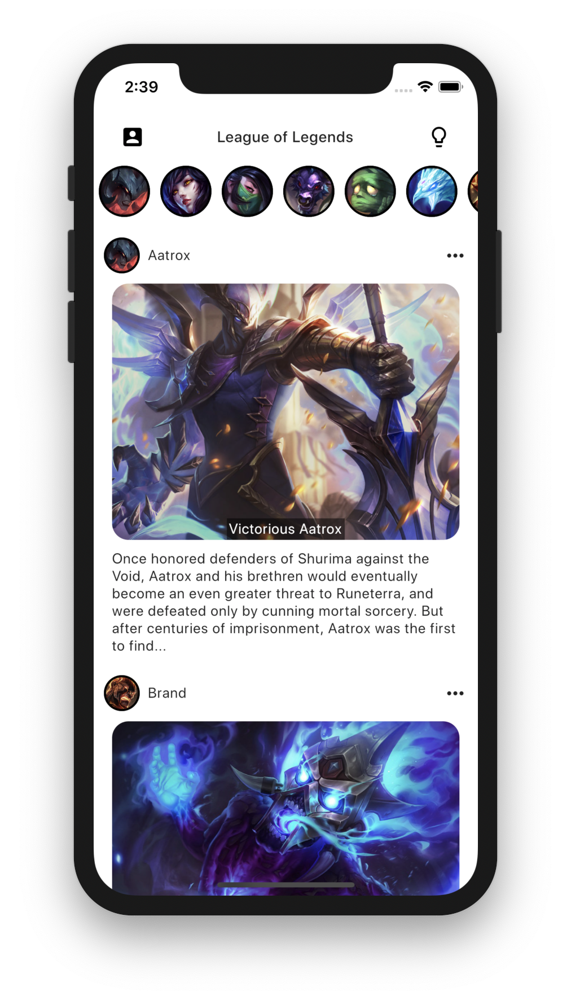
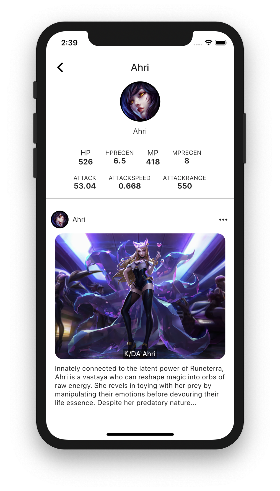
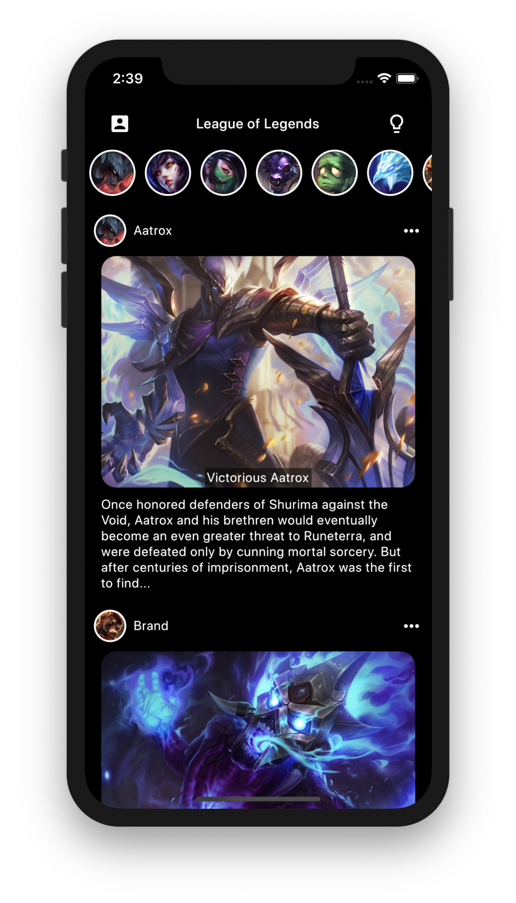
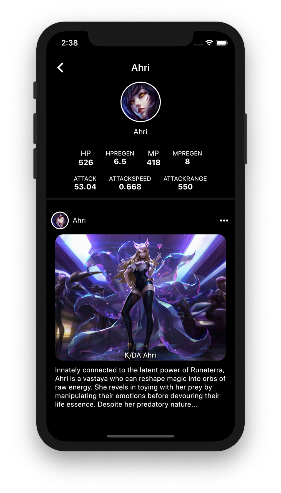
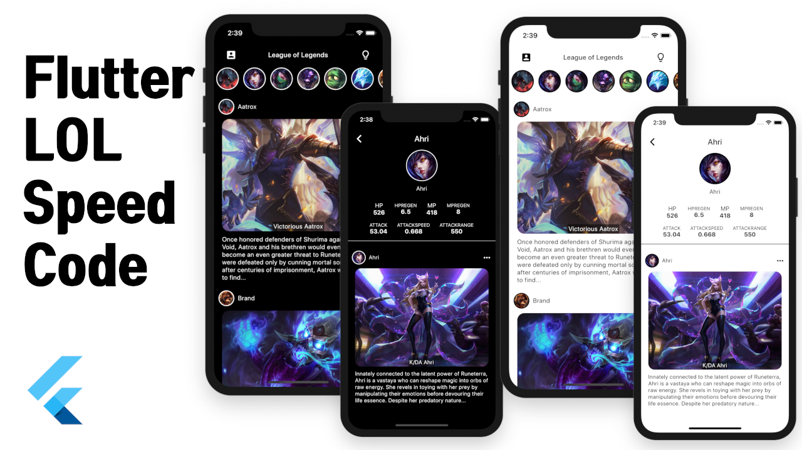

# Flutter LOL
Flutter Toy Project #4 - Provider Study

Using the League of Legends resource to practice the Provider

 
 

### Speed Code

### Reference

League of Legends Data👇🏻
1. Developer RiotGames
* https://developer.riotgames.com

2. Policies
* https://developer.riotgames.com/policies/general

3. Data Resources
* https://developer.riotgames.com/docs/lol#data-dragon_champions

FlutterLOL isn't endorsed by Riot Games and doesn't reflect the views or opinions of Riot Games or anyone officially involved in producing or managing Riot Games properties. Riot Games, and all associated properties are trademarks or registered trademarks of Riot Games, Inc.
